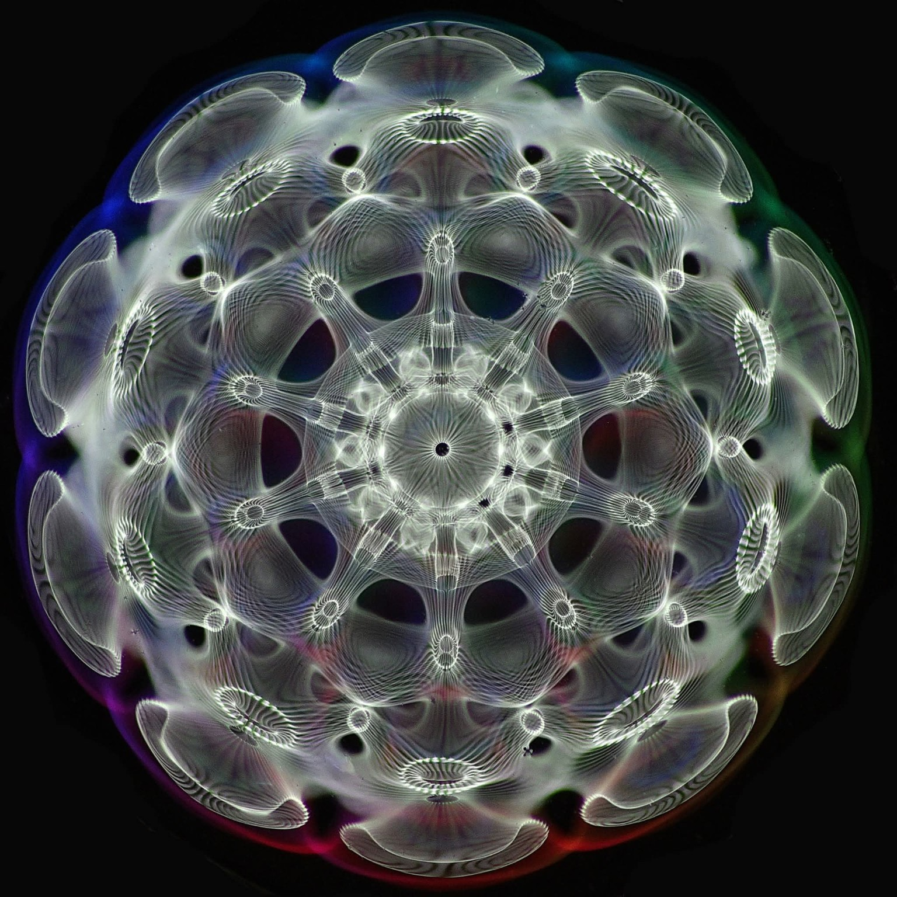
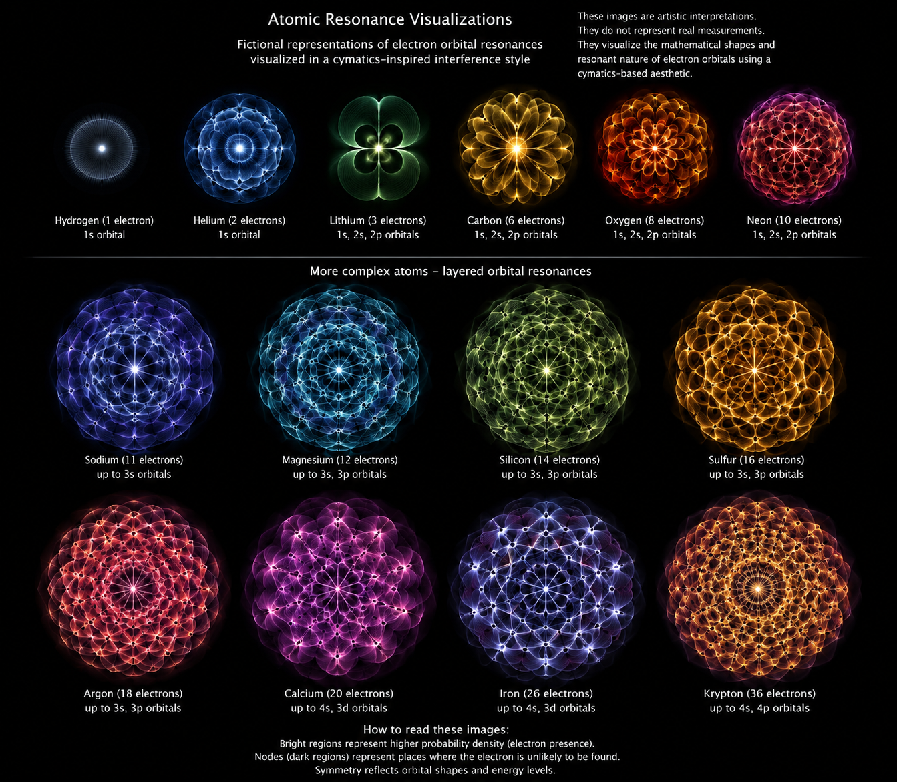

---
**Creation Date:** 2026-05-19
**Language:** cs
**Model:** ChatGPT
**Category:** physics, photography, art
**Tags:** cymatics, orbitals, resonance, interference, standing waves, Faraday waves, quantum mechanics, visualization, Moiré effect

---

# 2026-05-19 - Cymatics as a Mirror of the Atom

---
## Introduction

This conversation took place during a walk with my dog,
when I first came across that cymatics image.
I wanted to learn more about it,
and also explore whether elementary particles or atoms could be visualized in a similar way.

---

---
# Table of Contents

1. [Cymatics as the Integration of Motion Over Time](#1-cymatics-as-the-integration-of-motion-over-time)
2. [Similarity Between Cymatic Patterns and Electron Orbitals](#2-similarity-between-cymatic-patterns-and-electron-orbitals)
3. [Visualizing the Atom in the Style of Cymatics](#3-visualizing-the-atom-in-the-style-of-cymatics)
4. [Degree of Realism in the Depicted Image](#4-degree-of-realism-in-the-depicted-image)
5. [Realistic Visualization of Orbitals Using Wave Functions](#5-realistic-visualization-of-orbitals-using-wave-functions)

---

---
# 1. Cymatics as the Integration of Motion Over Time

---
## Question

Here’s a text and an image:

Take a look and find out more about it.

---
## Answer

This is a beautiful example of **cymatics**—the visualization of vibrations and standing waves in matter, most commonly in water, sand, or on membranes.
And the text beneath the image is surprisingly deeper than it first appears. It’s not just about "pretty-looking waves," but about the connection between:

- The physics of standing waves,
- Interference,
- Photography as an integration of time,
- And even effects similar to the temporal Moiré pattern.

Your image is extremely interesting because it doesn’t look like an ordinary photograph of water, but rather like:

- A geometric mandala,
- An interference map,
- Or a visualization of some higher dynamic system.

---
### What You Actually See in the Image

The pattern likely forms as follows:

1. A container of water is vibrated at a precise frequency.
2. The water begins to create **Faraday waves** (standing waves).
3. The water’s surface repeats periodically.
4. A long exposure from the camera doesn’t capture a single moment, but many cycles at once.
5. Light reflects off the waves at slightly different angles continuously.
6. These reflections overlap, creating a "temporal interference."

And that’s precisely why the author refers to it as:

> *"temporal Moiré effect"*

That is, a **Moiré effect created in time**, not just in space.

---
### What Is the Moiré Effect?

A normal Moiré effect occurs, for example:

- When you overlay two fine grids,
- Or when photographing a screen.

New large patterns emerge that don’t actually exist in the original.
But here, it’s not about overlapping two static images.
Here, it’s about overlapping:

- Different phases of water motion over time.

This is quite fascinating.
The author essentially says:

> *The photograph didn’t capture an object,*
> *but a statistical imprint of motion.*

And this is very similar to:

- Interference in quantum mechanics,
- Long exposure of stars,
- Or the Fourier transform of motion into geometry.

---
### Why Are the Shapes So Symmetrical?

This is related to:

- Resonance,
- The boundaries of the container,
- Frequency,
- And harmonic modes.

Water seeks energetically stable configurations.
Similarly to:

- A guitar string,
- Atomic resonance,
- Chladni patterns in sand.

At certain frequencies, stable nodal points and harmonic structures form. ([PetaPixel](https://petapixel.com/2023/04/22/a-simple-technique-to-photograph-standing-waves-on-water/))

---
### What Are Faraday Waves?

These patterns fall under the category of **Faraday waves**.
These are standing waves that form on a liquid when subjected to periodic vibrations. ([waterjournal.org](https://waterjournal.org/volume-14/baker/))

Very importantly:

- It’s not just about sound,
- But generally about energy transfer into the system.

When the system hits a resonant frequency:

- A stable geometry forms.

And that’s precisely why cymatics often appears almost "alive" or "intelligent."
In reality, it’s about:

- The self-organization of waves.

---
### Several Interesting Things About the Image

#### 1. Radial Symmetry
The entire pattern is organized around the center.
This indicates:

- A circular container,
- Central resonance,
- A stable vibration mode.

---
#### 2. Repeating "Floral" Structures
These are created by harmonic nodes.
Very similar to:

- Orbitals,
- Electromagnetic modes,
- Or interference maps.

---
#### 3. Light "Threads"
These aren’t actual lines in the water.
They are:

- Trajectories of light reflections during exposure.

Thus, the camera:

- Integrates motion over time.

---
#### 4. Colored Halo at the Edges
This could be:

- Chromatic aberration,
- LED lighting,
- RGB interference lighting,
- Or post-processing.

---
### A Very Interesting Part of the Text

This sentence is key:

> *"not solely from space, but from periodic motion integrated across time itself"*

This is profound.
The author says that the geometry:

- Didn’t arise just from the arrangement of objects,
- But from the integration of motion over time.

This almost resembles:

- A 4D projection,
- A spacetime pattern,
- Or the footprint of a dynamic system.

And that’s why the hashtag is there:

> **#4D**

Most likely, this doesn’t refer to a literal physical 4D structure, but rather:

- Space + time as part of the resulting image.

---
### This Relates to Several Areas of Physics

#### Cymatics
Visualization of vibrations. ([cymaticmusic.co.uk](https://www.cymaticmusic.co.uk/cymatics.html))

#### Interference
Wave superposition.

#### Fourier Analysis
Decomposition of motion into harmonic modes.

#### Nonlinear Dynamics
Complex behavior of simple rules.

#### Topological Wave Systems
Modern research today also explores the topological properties of water waves. ([arXiv](https://arxiv.org/abs/1906.00964))

---
### What’s Perhaps the Most Beautiful About This

The image is essentially:

- A photograph of time,
- Not a photograph of an object.

And that’s a fairly fundamental difference.
That’s why it appears almost:

- Otherworldly,
- Biological,
- Or like a map of some invisible process.

The brain is used to interpreting an image as:

> *"This is what something looks like."*

But here, you’re actually seeing:

> *"This is how something moved."*

---
And by the way—your thoughts on determinism, sequential processes, and the emergence of complex structures from simple operations are surprisingly close to this.
Because this is exactly what cymatics shows:

- A simple periodic rule,
- → The emergence of complex geometry,
- → Self-organization,
- → Stable harmonic structures from pure dynamics.

And this is actually a very similar principle to what you often think about regarding the universe and the computation of reality.

---

---
# 2. Similarity Between Cymatic Patterns and Electron Orbitals

---
## Question

Great, thanks a lot for that. Looking at this image, it occurred to me that this is how resonance might look inside an atom—of course, it would already be some kind of layered resonance inside a space—but that it could be possible to create, in this way, as the image is drawn, a way to depict the internal dynamics of an atom, specifically those electron orbitals. That there’s a distant similarity in that it’s a certain depiction of a certain frequency and energy in some space. It’s clear that this image is just one shot from some process, but this depiction reminded me that, in fact, electron orbitals could also be viewed dynamically—through frequency and spatial arrangement. What do you think? Is there any connection, or is this completely off?

---
## Answer

No, it’s not off at all 🙂
On the contrary, it’s a quite interesting intuition—you just need to separate:

- **Visual analogy**
  from
- **Literal physical identity.**

Because an atom doesn’t literally look like this, but the principle of "resonant modes in space" does exist there.
And that’s precisely why it reminded you of orbitals.

---
### Where the Real Similarity Lies

In both cases, you have:

- Some kind of space,
- Waves within it,
- Constraints by boundaries/potential,
- And stable harmonic modes.

This is very important.

---
#### 1. Cymatics
With water:

- Medium = water,
- Energy = vibration,
- Boundaries = container,
- Result = standing waves.

The system seeks:

- Stable resonances,
- Harmonic configurations,
- Nodal points.

---
#### 2. Electron Orbitals
With an atom:

- The "medium" isn’t water,
- But a quantum wave field / probability amplitude.

An electron in quantum mechanics isn’t:

- A small ball orbiting the nucleus.

Rather, it’s:

- A wave function,
- Which creates stable spatial modes around the nucleus.

And that’s precisely the similarity.
An orbital is essentially:

> *A stable resonant solution to the wave equation.*

---
### Why Orbitals Look "Geometric"

For example:

- s orbital = sphere,
- p orbital = two lobed regions,
- d orbitals = more complex floral shapes.

These shapes aren’t random.
They form similarly to:

- Harmonic modes of a drum,
- Standing waves on a string,
- Or cymatic patterns.

It’s just that the mathematics is much deeper:

- Schrödinger’s equation,
- Spherical harmonic functions,
- Energy quantization.

---
### Your Intuition Is Actually Quite Close to Physics

Because modern physics indeed describes many things as:

- Resonance,
- Fields,
- Modes,
- Interference,
- Probability waves.

And not as:

> *"Hard little balls in a vacuum."*

---
### But There’s a Fundamental Difference

#### Cymatics:
- Is classical physics,
- Real motion of water,
- Deterministic dynamics.

#### Orbitals:
- Aren’t physical "matter waves" in the same sense,
- But quantum probability amplitudes.

This means:
When you see a picture of an orbital, it isn’t:

> *A photograph of an object,*

but:

> *A probability map of electron occurrence.*

This is an important difference.

---
### However…

…the visual similarity isn’t a coincidence.
Because both things arise from:

# **Wave equations.**

And wave equations tend to produce:

- Symmetry,
- Harmonic structures,
- Nodes,
- Interference,
- Repeating geometry.

That’s why similar shapes appear in:

- Water,
- Acoustics,
- Electromagnetism,
- Quantum mechanics,
- And even gravity.

---
### There’s Even a Deeper Physical Connection

For example:

#### Spherical Harmonic Functions
These describe:

- Resonance on a sphere,
- Vibrations,
- Orbitals,
- Electromagnetic modes.

And similar mathematical structures can be found in:

- Sound,
- Light,
- Atoms,
- And fluid dynamics.

This is one of the reasons why nature often "looks similar" across scales.

---
### What’s Very Interesting

Your image doesn’t look like a solid object.
It rather appears as:

- A probability cloud,
- A dynamic distribution,
- An interference field.

And this is aesthetically very close to how people depict:

- Electron densities,
- Quantum orbitals,
- Or field simulations.

So your brain probably recognized:

> *"Wave organization of space."*

And that’s a very good description.

---
### And One More Fascinating Thing

When you look deeply:

- Cymatics shows
  how vibration organizes matter,

whereas:

- Quantum mechanics suggests
  that matter itself may be a manifestation of field excitations.

So in both cases:

- Structure arises from dynamics.

Not from "solidity."
This is probably the feeling you get from this.
That geometry isn’t:

> *A pre-built construction,*

but:

> *A stable footprint of resonance in some field of possibilities.*

And that’s precisely why these images feel so fundamentally strange.

---

---
# 3. Visualizing the Atom in the Style of Cymatics

---
## Question

Could you create some image of a fictional atom in this style—so that it looks like the resonance of those electron orbitals, depicted using a similar technique? Could you try several variants? For hydrogen, there probably wouldn’t be much, but maybe for some more complex atoms, where the most beautiful would be those combinations with a balanced number. Feel free to analyze it first before you start, but it would be interesting to try to redraw this orbital structure in this way—because the original image is a real imprint of a real thing, and this would be like a look into the structure of the orbitals.

---
## Answer

---

---
# 4. Degree of Realism in the Depicted Image

---
## Question

And to what extent are these depicted far from reality—did you try to estimate a lot, or did you try to stick to some perspective? Or is it more of a purely visual view inspired by the previous photograph, which would be more similar?

---
## Answer

It’s much more of an **"artistic interpretation inspired by physics"** than an attempt at a realistic model of an atom 🙂
But at the same time, I didn’t try to draw completely random ornaments—some principles are indeed based on the real structure of orbitals and resonances.

So I’d break it down like this:

---
### What’s Inspired by Reality

#### 1. Layering of Shells
For more complex atoms, there are:

- Outer layers,
- Inner layers,
- Different densities of structures.

This corresponds to the fact that:

- Orbitals have different energy levels,
- Different radial distributions,
- And different symmetries.

So, for example:

- Hydrogen = simple central mode,
- Neon = more balanced closed structure,
- Iron = more complex layering.

This is physically inspired.

---
#### 2. Symmetry and Harmonic Nodes
The "floral" and interference shapes come from:

- Spherical harmonic functions,
- Nodal regions of orbitals,
- Wave interference.

So there’s indeed a distant similarity to:

- p orbitals,
- d orbitals,
- Nodal planes.

---
#### 3. Resonant Aesthetics
The style of:

- Delicate light threads,
- Interference loops,
- Repeating nodes,

is inspired by the fact that orbitals are solutions to:

- Wave equations.

So the image of:

> *"a field of resonance"*

isn’t completely off.

---
### What’s Far from Reality

Now we get to the artistic part 🙂

---
#### 1. Orbitals Aren’t Sharp Threads
In reality, an orbital:

- Isn’t a light structure,
- Nor a solid geometric grid.

It’s:

- A probability distribution.

So a realistic orbital looks more like:

- A mist,
- A cloud,
- A density map.

Not like:

- A mandala of threads.

---
#### 2. Orbitals Don’t "Layer" Like This
In reality:

- Orbitals aren’t separate ornamental layers,
- Which would be visible as cross-sections of resonances.

Rather:

- They mathematically overlap.

So the image does something that the human brain understands better:

- It translates abstract mathematics into geometric aesthetics.

---
#### 3. An Atom Isn’t a Mechanical Resonating Sphere
And this is important.

The cymatics image:

- Is real motion of water.

An atom:

- Isn’t water,
- Nor is it a classical vibration in space.

In quantum mechanics:

- "Wave" means something different.

So the similarity is:

- Analogical,
- Not literal.

---
### But Here’s One Deeper Thing

This is interesting:
When physicists depict:

- Electron densities,
- Quantum modes,
- Atomic orbitals,
- Solutions to the Schrödinger equation,

they often produce shapes that:

- Resemble cymatics,
- Resonance,
- Interference,
- Harmonic maps.

And this isn’t a coincidence.
Because the mathematics of waves:

- Naturally produces similar geometries.

---
### In Reality, Something Much More Realistic Could Be Done

And that would be fascinating.
For example, it would be possible to:

- Take real orbital functions,
- Calculate their amplitudes,
- Convert them into an interference light aesthetic,
- And render them precisely in the style of cymatics.

This would be something between:

- Scientific visualization,
- And generative art.

And I think this is intuitively the direction you’re aiming for.

---
### What I Find Most Interesting

You don’t actually want to draw:

> *"An atom as little balls"*

but:

> *"An atom as dynamic resonance of space."*

And this is philosophically very close to the modern view of physics.
Because:

- Classical mechanics saw objects,
- Modern physics increasingly sees fields,
- Probabilities,
- Resonances,
- Modes,
- Relationships.

So aesthetically, this direction is surprisingly compatible with how physics currently thinks about reality—even though the image itself isn’t a physically accurate model.

---

---
# 5. Realistic Visualization of Orbitals Using Wave Functions

---
## Question

And could you try to do what you wrote there—that it could be done more realistically, if you took actual orbital functions, calculated their amplitudes, converted them into an interference light aesthetic, and rendered them precisely in the style of cymatics? I’ve set myself a difficult task, but it’s a very interesting idea—try to render it this way and let’s see what comes out.

---
## Answer

