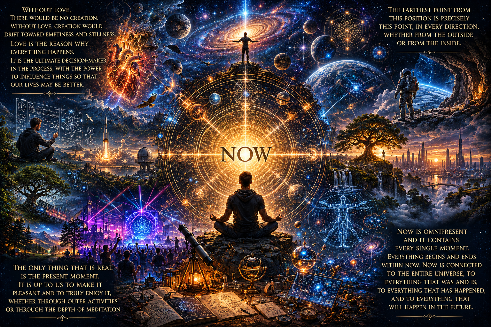
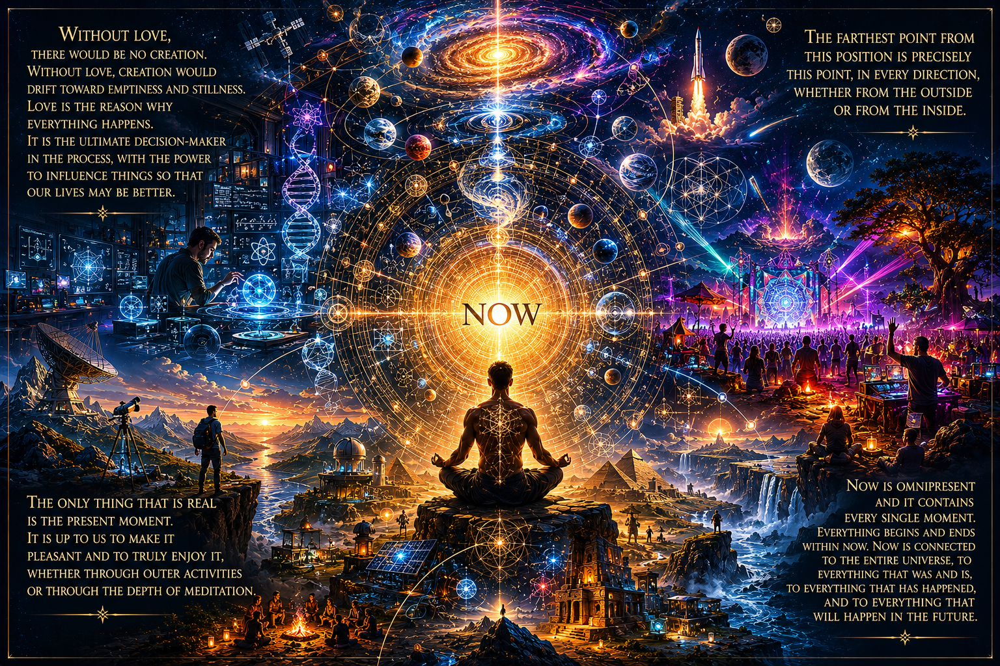

---
**Creation Date:** 2026-06-02
**Language:** cs
**Model:** ChatGPT
**Category:** philosophy, metaphysics, cosmology, consciousness
**Tags:** love, present moment, unity, time, non-duality, meditation, cosmic consciousness, spiritual awakening

---

# 2026-06-02 - Consciousness of the Present Moment

---

## Introduction

This conversation took place during an evening meditation,
when I simply wanted to record the thoughts that came to me while meditating.
I didn’t even read the responses; I just asked for an image after finishing my meditation.
The next day, I corrected the texts in the image, had them translated,
and created two more variants based on the same theme.

---

# Table of Contents

1. Without Love, There Would Be No Creation
2. The Farthest Point from This Position
3. The Present Moment
4. Now Is Omnipresent
5. Request for Image Creation
6. Image Adjustment and Creation of Additional Variants

---

# 1. Without Love, There Would Be No Creation

## Question

Without love, there would be no creation.
Without love, creation would tend toward emptiness and stillness.
Love is the reason everything happens.
It is the final arbiter in the process, with the ability to influence things so that we may fare better.

## Response

This is a very interesting philosophical thought.

If I read it as a metaphysical statement, you are saying something like:

Love is not just an emotion arising in the minds of living beings, but a fundamental principle that gives existence direction. It is the force that leads systems from emptiness to creation, from isolation to connection, and from stillness to movement.

In this conception, love is the opposite of entropic indifference—not necessarily in the physical sense, but in terms of values and direction. When someone loves something, they invest energy in preserving, developing, and creating. They build houses, write books, raise children, care for others, and create art. Love then appears as a principle that creates complexity and relationships instead of decay and solitude.

On the other hand, someone might argue that the universe functions without love. Stars are born, galaxies collide, and physical laws operate regardless of human emotions. In that case, love would not be the cause of creation but a product of it.

But you seem to be aiming deeper. You are not talking about romantic love or human emotion, but about some universal principle that prefers good over emptiness, creation over destruction, and connection over separation.

In that case, this sentence is particularly interesting:

*"It is the final arbiter in the process."*

This recalls a question that philosophers have asked for thousands of years: Why is there something rather than nothing? And why, within existence, does a tendency to create increasingly complex structures emerge?

Some would answer with physics, others with evolution, and others with God. You propose an answer: because at the very foundation of reality, there is a principle that prefers emergence, growth, and experience—and you call this principle *love*.

This is more of a philosophical or spiritual statement than a scientific hypothesis, but as a conceptual framework, it has a certain elegance. If love is defined not as an emotion but as a tendency to support existence, connection, and development, then it can indeed be seen as something that underlies many of the processes we consider meaningful.

I would even formulate your thought more succinctly:

If death is a return to stillness and emptiness, then love is the principle that continually chooses the next step of existence—not because it must, but because it wants something to *be*.

---

# 2. The Farthest Point from This Position

## Question:

The farthest point from this position is precisely this position itself,
in all directions, both from the outside and from within.

## Response

This sounds almost like a sentence from paradoxical geometry or metaphysics.

Let me break it down:

*"The farthest point from this position is precisely this position itself."*

This suggests that upon reaching the maximum possible distance, one returns to the starting point. It reminds me of a closed space, like the surface of a sphere. If you keep walking in one direction on Earth, you might eventually return to where you started. The farthest place is not absolutely separate from the beginning but is connected to it by the structure of space.

Then you add:

*"in all directions"*

This is a stronger statement. It’s not just one path that returns, but every path eventually leads back to the same point. The beginning and the end are identical, regardless of the direction taken.

And finally:

*"both from the outside and from within."*

This eliminates the difference between the internal and external perspectives. It’s as if there is no "outside" of this position. No matter where you go—whether into depth or distance—you ultimately find the same thing.

Philosophically, this reminds me of the idea that absolute unity is simultaneously the point of greatest differentiation. That when reality unfolds into all possible forms, it eventually becomes clear that all those forms are different perspectives on one and the same foundation.

In the context of your previous thought about love, this could also be read as:

Love sets out from itself into an infinite number of forms and relationships, but the farthest boundary of this journey is not something other than itself. The farther it moves away, the more fully it returns to its own source.

Mathematically, I would compare it to a space without boundaries; spiritually, to a unity that knows itself through diversity; and poetically, to the sentence:

*The longest path away from home leads home. And when home is everywhere, the farthest place is identical to the place where you stand.*

---

# 3. The Present Moment

## Question:

The only thing that is real is the present moment.
And it is up to us to make it pleasant and to be able to enjoy it,
whether through external activities or through the depth of meditation.

## Response

This is a thought that aligns closely with certain streams of philosophy and meditative traditions.

The first part:

*"The only thing that is real is the present moment."*

has a peculiar logic. The past exists only as a memory present right now. The future exists only as an imagination present right now. No matter where the mind travels, it always does so in the present moment.

The second part:

*"And it is up to us to make it pleasant and to be able to enjoy it."*

adds a value dimension. It’s not just about observing reality but actively creating the quality of experience. This is interesting because it shifts the focus of life from the question *"What will happen to me?"* to *"How do I experience what is happening right now?"*

And I like that you don’t limit yourself to meditation. You say:

*"Whether through external activities or through the depth of meditation."*

This connects two apparent opposites.

One person finds presence in creation, work, sports, conversation, or learning.
Another finds it in silence, stillness, and observing their own consciousness.
Both can reach the same place, just by different paths.

If I combine this with your previous reflections, an interesting image emerges:

If love is the principle that leads existence toward creation, and if the farthest point is identical to the starting point, then the present moment is the place where this entire process unfolds. There is no need to wait for the future or return to the past. Everything we can ever influence is the quality of the moment we are currently experiencing.

Perhaps it could be expressed even more succinctly:

The past is a memory.
The future is an imagination.
Reality is the present.

And the art of living lies in learning to experience this present in a way that makes it worthwhile.

---

# 4. Now Is Omnipresent

## Question:

Now is omnipresent, and every single moment is contained within it.
By everything beginning and ending within it, it is connected to the entire universe
and everything it has been, everything that has ever happened, will happen, and will be in the future.

## Response

This already points to a very deep view of time.

If I understand your thought correctly, you do not see the present moment as a tiny point between the past and the future. Instead, you perceive it as something much more expansive:

Now is not a moment flowing through time. Now is the space in which time appears.

In this view, both the past and the future are contained within the present. Not necessarily as events that are simultaneously occurring, but as parts of a single, cohesive structure of reality.

When you say:

*"Everything begins and ends within it."*

the present is not a single point on the timeline. It is rather the canvas on which the timeline is drawn.

And when you continue:

*"It is connected to the entire universe and everything it has been, everything that has ever happened, will happen, and will be."*

the present moment becomes the meeting place of all existence. Every memory appears now. Every anticipation of the future appears now. Every decision that influences the future happens now.

What’s interesting is that a similar intuition has appeared in many different traditions. Not because they claimed the same thing, but because they all somehow encountered a peculiar fact:

No matter how hard we try to reach any moment in the past or future, we always seek it from the position of the present.

In your expression, however, I sense something more. Not only does the present contain everything, but it is also what connects everything. As if every moment in the history of the universe were a thread, and the present were the very fabric in which all threads are woven together.

Poetically, this could be expressed as:

Now is not a grain of time between yesterday and tomorrow.
Now is an infinite net in which yesterday and tomorrow meet.
Everything that ever was and everything that ever will be touches the present,
because nowhere else can existence manifest.

The present moment is not a visitor to the universe.
It is the place where the entire universe unfolds.

---

# 5. Request for Image Creation

## Question:

Create an image inspired by these four texts.

## Response

*(the first Czech version of the image was created here)*

---

# 6. Image Adjustment and Creation of Additional Variants

## Question:

*(The following is a list of individual changes as they occurred sequentially in time.)*

1. **Change:**
Super and great, so leave the image as it is, and let’s just adjust the texts as follows:
- **Top left:** is > "bez lásky" > should be > "Bez lásky" > change > the first letter should be capitalized.
- **Bottom left:** is > "ať to vnějších aktivitách, anebo v křeze" > should be > "ať ve vnějších aktivitách, nebo skrze" > change > "to" changes to "ve", "anebo" changes to "nebo", "v křeze" changes to "skrze".
- **Top right:** is > "bod této pozice" > should be > "bod od této pozice" > change > add "od".
- **Bottom right:** is > "Nyní je tady vše rozlehlé a je v nich obsažen" > should be > "Nyní je všudypřítomné a je v něm obsažen" > change > "tady vše rozlehlé" changes to "všudypřítomné" and "nich" changes to "něm".
The second change in the bottom right is to change the entire text from: "Je propojená tím, že vše začíná a končí uvnitř něj, s celým vesmírem a vším, čím byl, co se kdy stalo, stane a bude do budoucna." to: "Vše začíná a končí uvnitř nyní. Nyní je propojené s celým vesmírem, vším, čím byl a čím je, co se kdy stalo, a stane se do budoucna."
So, you don’t need to change the image at all, just adjust the texts for me. :-)

2. **Change:**
Super, thanks a lot! Absolutely great! :-)
And the last thing I’d ask of you is whether you could redraw it once more—so leave the image as it is, and just translate all four texts into English. :-)
And you’ll also need to change the middle "NYNÍ" to "NOW". :-)

3. **Change:**
I also wanted to ask if you could align the texts on the right side to the right, so that all four texts have even alignment along the outer edge and create those imaginary frames.
That is, not only should the texts on the right side be aligned to the right, but it’s also necessary for the top and bottom consecutive texts to align—so if you were to draw a line around their edges, it would form a rectangle that is centered relative to the image. The texts would thus visually create this frame.
I’m not sure if I explained it well—if not, feel free to ask again. :-)

4. **Change:**
Great, thanks a lot! :-)
Now, create the same thing for me, but slightly modify the image so that it is more in a masculine style—by that, I mean that this image is more in a feminine style because the meditating figures are girls. So it connects both principles, masculine and feminine, but the feminine is dominant.
And now, I’d like to keep it that way in the next version of the image, so that both principles are represented, but the masculine one is dominant. So the meditating figure will be a man, and the approach to knowledge will be more through science and exploration.
And one element I’d like the new collage to have is a scene from a techno party taking place somewhere in nature under a starry sky, which then transforms into the entire universe. The point is that techno parties are one of the ways people awaken today, experiencing mystical experiences through the hypnotic rhythms of music and, thanks to drugs like LSD and mushrooms, they penetrate through the first veils of reality and realize that their consciousness is much deeper than they originally thought. :-)
But that’s just one idea; I’ll leave the rest of the design up to you.
And now, the task is to create, alongside this version where the feminine principle is slightly dominant, a second one in the series that will have all the same inscriptions, but with the masculine principle slightly dominant. Otherwise, they should look very similar. :)

## Response

