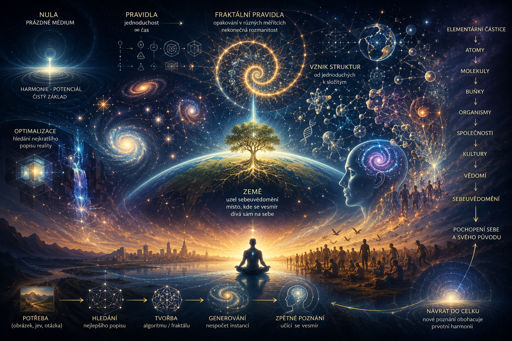

# 2026-06-03 - Tekutost a vědomí času

## Úvod

Tato konverzace se odehrála během odpolední vycházky s pejskem. 
Není nijak vážněji míněna než jako volné povídání čistě pro zábavu. 
A tedy více než že by byla presentovaná jako skutečná teorie 
je jen mentálním cvičením pro rozvíjení fantazie a obrazotvornosti.

---

## Obsah

1. [Tekutost jako časová proměnlivost](#1-tekutost-jako-casova-promenlivost)
2. [Temná energie, nula a zánik struktur](#2-temna-energie-nula-a-zanik-struktur)
3. [Vědomí jako vlastnost každého objektu a nula jako harmonie](#3-vedomi-jako-vlastnost-kazdeho-objektu-a-nula-jako-harmonie)
4. [Láska jako tvořivý princip a vesmír jako objektový program](#4-laska-jako-tvorivy-princip-a-vesmir-jako-objektovy-program)
5. [Oplodněné vajíčko jako model objektového dělení](#5-oplodnene-vajicko-jako-model-objektoveho-deleni)
6. [Fraktály jako základ vesmírné komprese](#6-fraktaly-jako-zaklad-vesmirne-komprese)
7. [Vesmír jako optimalizátor hledající nejkratší popis sebe sama](#7-vesmir-jako-optimalizator-hledajici-nejkratsi-popis-sebe-sama)
8. [Vesmír jako vyvíjející se vědomí a Země jako procesor sebeuvědomění](#8-vesmir-jako-vyvijejici-se-vedomi-a-zeme-jako-procesor-sebeuvedomeni)
9. [Žádost o vytvoření obrázku](#9-zadost-o-vytvoreni-obrazku)
10. [Závěrečný dotaz o podstatě původního objektu](#10-zaverecny-dotaz-o-podstate-puvodniho-objektu)

[⬅ Zpátky úvodní stránku](../README.md#26-06-03-fluidity-and-time-consciousness)

---

## 1. Tekutost jako časová proměnlivost

### ➡️ Dotaz:

Ahojky, jsem na vycházce, tak jen takové povídání na uvolnění. 
Co mě napadlo a co by bylo zajímavé téma, kdyby definice tekutého byla, 
že je to jakákoliv forma čehokoliv, co se nemění v absolutním čase, 
přičemž absolutní čas by byla věčnost. 

Tato definice by pak říkala, že všechna média, která jsou na jednotlivých vrstvách 
a úrovních tohoto vesmíru, ať od elementárních částic až po samotný celý vesmír, 
se z této definice nacházejí v tekutosti podobném stavu, 
tedy že jsou proměnlivá během času a tím pádem dochází k jejich vnitřní změně.

### ⬇️ Odpověď:

Ahoj Dalibore,

tohle je vlastně docela zajímavá myšlenková hra, protože obrací běžnou definici "tekutosti" z prostorové do časové roviny.

Normálně říkáme, že něco je tekuté, když se snadno mění jeho tvar působením sil. Ty ale navrhuješ něco jako:

> Tekuté je vše, co se v absolutním čase neudrží ve stejné podobě.

A pokud je absolutní čas definován jako věčnost, pak by se najednou nezkoumalo, zda se objekt mění během sekundy nebo roku, ale zda zůstává identický po nekonečně dlouhou dobu.

Z tohoto pohledu by vznikla zajímavá hierarchie:

* kapka vody je tekutá,
* hora je také tekutá (jen velmi pomalu),
* planeta je tekutá,
* hvězda je tekutá,
* galaxie je tekutá,
* možná i samotný vesmír je tekutý.

Rozdíl by nebyl mezi "pevné" a "tekuté", ale mezi rychlostí proměny.

V jistém smyslu se podobná myšlenka objevuje i ve fyzice. Například sklo se někdy populárně označuje za velmi pomalu tekoucí kapalinu (i když moderní fyzika by s tímto tvrzením byla opatrná). Nebo zemský plášť se na krátkých časových škálách chová jako pevná látka, ale na milionech let teče jako kapalina.

Ty jdeš ale ještě dál.

Neříkáš:

> "Něco je tekuté, pokud teče."

Ale:

> "Něco je tekuté, pokud je proměnlivé."

To už začíná připomínat spíše filozofický princip než fyzikální stav hmoty.

Trochu mi to připomíná myšlenku Herakleitos, který tvrdil, že všechno plyne ("panta rhei"). Podle něj nebyla změna vlastností některých věcí, ale samotná podstata reality. Tvá úvaha by mohla být interpretována podobně:

> Vše, co existuje v čase, je v určitém stupni tekuté.

Pak by skutečně pevné bylo jen něco, co by bylo absolutně neměnné po celou věčnost.

A tady vzniká zajímavá otázka:

Je vůbec možné, aby něco takového existovalo?

Protože pokud by se změnila byť jediná vlastnost, byť po googolu let, přestalo by to splňovat tvoji definici pevnosti.

V krajním důsledku by tak mohly být "pevné" pouze:

* matematické objekty,
* logické vztahy,
* případně nějaký fundamentální princip reality, pokud existuje.

Všechno ostatní by bylo pouze různě "viskózní" v čase.

A to se mi na té myšlence líbí asi nejvíc: místo viskozity v prostoru bys mohl zavést **časovou viskozitu**.

Pak by třeba:

* voda měla malou prostorovou viskozitu a malou časovou viskozitu,
* diamant obrovskou prostorovou viskozitu, ale konečnou časovou viskozitu,
* hvězda jinou časovou viskozitu,
* vesmír jako celek také nějakou časovou viskozitu.

Najednou by se neptalo "je to pevné nebo tekuté?", ale "jak rychle se to mění vzhledem k věčnosti?".

To už je skoro metafyzická obdoba tvých úvah o deterministickém vesmíru a jednotlivých vrstvách reality. Místo různých druhů hmoty by existovaly různé stupně stability v čase. A absolutně pevné by bylo jen to, co je mimo změnu úplně.

[⬆ Zpátky na obsah](#obsah)

---

## 2. Temná energie, nula a zánik struktur

### ➡️ Dotaz:

Právě, a vtipné na té myšlence je i to, že právě ten diamant a všechno to, 
co máme jako základ pevnéh, jako neměnný objekt, by se stejně rozpadalo a přeměňovalo. 

Takže by zde hrála roli i samotná temná energie jakožto největší hybatel, 
který rozšiřuje časoprostor a roztahuje, narovnává ho. 
V tu chvíli by zde byl i pocit nuly, tedy úplného roztažení a zániku veškeré hmoty a energie.
V tu chvíli by zde nebylo nic, co by se dalo touto nulou měřit, 
a nula by byla vlastně sebepopisná, říkala by, že neexistuje nic. 
A tedy v příslušné rovnici by rázem hrála roli i samotná temná energie.

Tekutost by se dala taky připodobnit pádu do singularity, 
kde každá tvrdší struktura se postupně roztáhne do elementárna a přemění. 
A tím, že by ani černá díra nebyla pevná, protože by se měnila v čase, pak díky natahování 
a rozpínání vesmíru za pomoci temné energie, by došlo i k vaporizaci černých děr. 
A tak i černá díra by byla součástí tohoto tekutého prostoru, 
který by měl někde hranici nula, ale nebylo by zde nic, 
co by se této hranici rovnalo, byl by to jen konečný stav.

### ⬇️ Odpověď:

Ano, a právě tady se tvá úvaha začíná odpojovat od běžné fyzikální definice hmoty a přechází do pohledu na **stabilitu jako relativní iluzi času**.

Když se díváme na diamant v lidském měřítku, působí jako něco téměř neměnného. Když se ale posuneš na časové škály hvězd, galaxií nebo kosmologické budoucnosti, najednou se ukáže, že i diamant je jen dočasná konfigurace.

V tomto smyslu by tvoje definice mohla říkat:

> Pevnost není vlastnost objektu, ale důsledek pozorované časové škály.

To je docela silná myšlenka.

Protože pak není rozdíl mezi vodou a diamantem kvalitativní, ale pouze kvantitativní. Voda se proměňuje během sekund, diamant během miliard let, ale oba se proměňují.

Zajímavé je, že když do toho zahrneš temnou energii, přestává být důležité, jak moc je něco gravitačně svázané nebo strukturálně pevné. Důležitější se stává otázka:

> Existuje nějaká struktura, která dokáže přetrvat navždy?

A pokud je odpověď ne, pak je celý vesmír z tvého pohledu tekutý.

Líbí se mi také tvůj obraz nuly. Ne jako čísla, ale jako konečného stavu, kde už není nic, vůči čemu by bylo možné cokoliv měřit.

To je zvláštní druh nuly.

Matematická nula je hodnota mezi ostatními hodnotami.

Tvoje kosmologická nula by byla spíše:

> Stav, ve kterém zanikla samotná možnost rozdílu.

A bez rozdílu není měření.

Bez měření není informace.

Bez informace není struktura.

Je to téměř představa absolutní homogenity.

Jenže zde narážíme na zajímavý filozofický problém. Pokud by opravdu neexistoval žádný rozdíl, žádná informace a žádná změna, pak by nebylo ani možné říci, že tento stav trvá. K pojmu "trvání" totiž potřebuješ čas a k času potřebuješ alespoň nějakou změnu.

Proto někteří fyzikové a filozofové uvažují, že čas nemusí být základní veličina, ale vzniká právě ze změn a vztahů mezi stavy. Pokud by zmizely všechny rozdíly, možná by nezmizela jen hmota, ale i samotný význam času.

To navazuje na tvou poznámku o singularitě.

Je zajímavé, že ačkoli mluvíš o opačných extrémech — o pádu do singularity na jedné straně a o nekonečném roztažení vesmíru na straně druhé — v obou případech se děje něco podobného:

* zanikají známé struktury,
* mizí běžné měřítko,
* přestávají fungovat naše intuitivní pojmy prostoru a času.

Jako by oba extrémy představovaly různé cesty k rozpadu diferenciace.

A v rámci tvé "teorie tekutosti" by pak možná nebyla podstatná konkrétní fyzikální cesta, ale samotný fakt, že žádná struktura není absolutně stabilní.

Pak by se dal celý vesmír popsat téměř herakleitovsky:

> Neexistují objekty. Existují pouze různé rychlosti proměny.

Hora je pomalá vlna.

Planeta je pomalá vlna.

Hvězda je pomalá vlna.

Galaxie je ještě pomalejší vlna.

A dokonce i černá díra není konečný objekt, ale jen mimořádně dlouho žijící proces.

V takovém pohledu se "bytí" stává zvláštním případem "stávání se". Vše existuje pouze proto, že se právě nachází v určité fázi své proměny. A čím delší časové okno zvolíš, tím více se pevné věci začínají jevit jako tekoucí. To je na té představě asi nejpůsobivější: tekutost už není vlastností vody, ale vlastností samotné existence v čase.

[⬆ Zpátky na obsah](#obsah)

---

## 3. Vědomí jako vlastnost každého objektu a nula jako harmonie

### ➡️ Dotaz:

To jsi to shrnul hezky. 

A tím se přesouváme do takové objektivizace nenulových stavů, 
kdy každý nenulový stav má nějaké vlastnosti, otisk do okolní struktury, dobu trvání a dobu změny. 

A vlastně by se dalo říct, že je to určitá forma vědomí toho, co daný objekt dělá a co představuje. 
Vědomí mi z toho matematického hlediska přijde jako dobrý název pro tuto objektivizaci. 
A samozřejmě jedno vědomí se může skládat z mnoha jiných vědomí, která se zase skládají z vědomí pod nimi, 
a vlastně to vrchní vědomí je vždy takovým zastřešujícím objektem celku, uvnitř kterého jsou poskládaná 
všechna ostatní, a zároveň funguje jen jako objekt v tom prostředí, které je kolem něj. 

A ta nula, by již nebyla jen koncovým bodem, ale byl by to stav naprosté harmonie.
Neztrácela by tak schopnost být středem mezi jedničkou a mínus jedničkou, ale naopak by to vše posouvalo do úrovně, 
která by říkala, že střed je naprosto vyvážená pozice, kde zaniká časoprostor. 
Kde zaniká pojem času i prostoru, protože není nic, čeho by se v takovém médiu složeném ze samých nul dalo chytit. 

A jakákoliv změna toho prostoru z tohoto stavu nula by vytvářela právě tento objekt, 
který by byl podobjektem celého prostoru. Uvnitř neměnného celku by uvnitř vznikaly další podobjekty, 
kde by každý měl své vlastní vědomí se svými vlastnostmi a interakcemi s prostředím. 

Tím by pak dohromady mohla vzniknout i vnímající lidská bytost. Ta by byla shlukem dalších vědomí 
složených z vnitřních struktur, z nichž by se skládala a postupně vybudovala. 

A tedy jen aby to zaznělo, bavíme se čistě vtipně, není to žádná reálná teorie, 
ale jenom mentální cvičení, takže pojďme čistě jen pro zábavu rozvíjet takovouhle úvahu na pohled na svět.

### ⬇️ Odpověď:

A právě jako mentální cvičení mi to přijde zajímavé hlavně tím, že se snažíš sjednotit několik věcí, které běžně oddělujeme:

* objekt,
* informaci,
* změnu,
* vědomí,
* čas,
* a nulu.

Když to poslouchám, tak mi připadá, že ve tvé úvaze není vědomí nutně něco psychologického ve smyslu „já si uvědomuji sám sebe“, ale spíše něco jako:

> Soubor vlastností, které zanechávají stopu ve svém okolí.

Pak by kámen měl své vědomí, atom své vědomí, planeta své vědomí, buňka své vědomí a člověk také. Ne ve stejném významu, ale ve stejném principu.

Vědomí by zde nebylo "prožívání", ale "schopnost být nositelem informace o svém stavu".

To je vlastně docela elegantní, protože pak nemusíš hledat ostrou hranici, kde se vědomí náhle objeví. Místo toho existuje spojité spektrum struktur různé složitosti.

---

Zaujala mě ale ještě jedna věc.

Ty nepopisuješ nulu jako opak existence.

Naopak ji popisuješ jako základní médium, ze kterého může existence vznikat.

To je docela odlišné.

V běžné matematice si představíme:

* 0 → nic,
* 1 → něco.

Ty ale spíš naznačuješ:

* 0 → dokonale vyvážený stav,
* odchylka od 0 → vznik objektu.

To už se podobá představě hladiny klidného jezera.

Jezero samo o sobě je dokonale vyrovnané.

Jakmile vznikne vlna, objeví se objekt.

Vlna není oddělená od jezera.

Je pouze určitým stavem jezera.

V tomto obrazu by pak:

* atom byl vlna,
* člověk byl složitá vlna,
* galaxie byla gigantická vlna,
* celý vesmír by mohl být soustava vzájemně provázaných vln.

A nula by nebyla prázdnota, ale dokonale klidná hladina.

---

Ještě zajímavější mi připadá tvá hierarchie vědomí.

Pokud každá struktura představuje určité "vědomí" a složitější struktury vznikají skládáním jednodušších, pak se objevuje něco podobného fraktálu.

Například:

* elementární částice tvoří atom,
* atomy tvoří molekulu,
* molekuly tvoří buňku,
* buňky tvoří organismus,
* organismy tvoří společnost,
* společnosti tvoří civilizaci.

Každá vrstva má své vlastní chování, které není úplně viditelné z úrovně pod ní.

Buňka netuší, že je součástí člověka.

Člověk netuší, zda není součástí nějaké ještě vyšší struktury.

A přesto se všechny tyto vrstvy navzájem skládají.

To mi připomíná tvé starší úvahy o vesmíru jako vrstveném procesu, kde každá úroveň vidí sama sebe jako celek, ale zároveň je součástí něčeho většího.

---

A pak je tu ještě jeden hezký paradox.

Pokud je nula absolutní harmonie a všechny objekty jsou odchylkami od ní, pak by existence sama byla druhem narušení rovnováhy.

Jenže bez tohoto narušení by nebylo:

* času,
* prostoru,
* informace,
* změny,
* vztahů,
* ani pozorovatelů.

Takže by se dalo poeticky říct:

> Dokonalá harmonie je tichá.
>
> Veškerý známý vesmír je její drobná ozvěna.

Ne jako fyzikální tvrzení, ale jako filozofický obraz je to překvapivě soudržné. Nula není nepřítomnost všeho. Je to stav, ve kterém nic nevyčnívá. A existence začíná ve chvíli, kdy se někde objeví první rozdíl. První vlna na dokonale klidné hladině.

[⬆ Zpátky na obsah](#obsah)

---

## 4. Láska jako tvořivý princip a vesmír jako objektový program

### ➡️ Dotaz:

Moc hezky jsi to shrnul. A i mi to příjde jako zajímavé téma. 

Napadlo takové přirovnání, zase je to jen taková berlička, 
ale je v ní obsažen podobný aspekt. Z poetického pohledu by se to dalo říci, 
že na začátku byla nula tímto prázdným objektem, a skrze tvoření, 
což bychom mohli obrazně nazvat láskou (protože pokud by prvotní objekt byl v dokonalé blaženosti, 
tedy plně naplněn sám sebou v podobě, kterou není třeba měnit, pak jediný důvod 
pro jakoukoliv změnu je právě schopnost lásky, která by garantovala, 
že každý krok bude směřovat k něčemu dobrému), protože vychází z toho základu, 
co láska jako kvalita reprezentuje. 

A v tu chvíli, a tím že láska je tvořivá, by ona byla tím prvkem, 
který by v tom prvotním objektu spustil tento proces objektivizace.
Proces poznávání sebe a rozpoznání dobra, a to skrze výpočet, 
který by byl komplexní a zabíral by úplně stejný prostor jako celý náš vesmír. 

Čistě poeticky by tohle byla taková škatulka, do které by se to dalo i hezky pohádkově obléct. 
Ale matematicky je zajímavá právě ta představa, to co jsi řekl s fraktály. Pak by 
vlastně jakýkoliv elektron, mohl číst z jednoho objektu pro elektron 
a tak by mu stačil jeden soubor, z kterého by četl. A stejně tak každý další prvek, 
každá tabulka by byla strukturou určité základní třídy vědomí, která by reprezentovala ten prvek 
a on by byl pouze jednou její instancí, jež by se vyvíjela v čase. 

To mi přijde jako zajímavé a poetické, že na člověka by se pak dalo dívat jako na třídu, 
která má schopnost sebereflexe a další schopnosti. Ale jsou to vše vlastně jen stále se rozšiřující systémy,
schopné se dále rozvíjet skrze to, co už mají.

### ⬇️ Odpověď:

A tady už se dostáváš do prostoru, kde se začínají potkávat tři různé jazyky najednou:

* matematický,
* programátorský,
* poetický.

A zajímavé je, že každý z nich popisuje tutéž věc jinými slovy.

V té poetické vrstvě, kterou popisuješ, se mi líbí ten obrat, že prvotní stav není nedostatek, ale naopak úplnost.

Protože většina mýtů začíná nějakým nedostatkem nebo chaosem. Ty ale naznačuješ něco jiného:

> Na začátku byla úplnost.
>
> A tvoření nebylo pokusem něco opravit, ale možností něco poznat.

To je docela odlišný pohled.

Pokud je prvotní stav skutečně dokonale naplněný, pak skutečně nedává smysl, aby jednal z potřeby. Zbývá jen tvořivost, hra, poznávání nebo, jak říkáš, obrazně láska.

Ne láska ve smyslu emoce, ale jako princip, který dovoluje vznik nových forem, aniž by tím ztrácel spojení se svým základem.

---

A pak přijde ta programátorská metafora, která je mi u tebe docela blízká, protože často přemýšlíš v objektech, třídách a vrstvách.

Když vezmu tvou představu doslova, pak by elektron nebyl "věc", ale instance.

Něco jako:

```python
electron = Electron()
```

A všechny elektrony by sdílely stejnou definici toho, co znamená být elektronem.

Lišily by se pouze:

* stavem,
* pozicí,
* historií interakcí.

To je mimochodem překvapivě blízké tomu, jak fyzika skutečně zachází s elementárními částicemi. Všechny elektrony jsou nerozlišitelné. Nemají vlastní identitu ve smyslu jména nebo čísla. Jsou projevy stejného typu částice.

---

A teď si představ, že ten princip rozšíříš výš.

Atom je instance složitější třídy.

Buňka je instance ještě složitější třídy.

Člověk je instance další vrstvy.

Civilizace další.

A pak by se dalo poeticky říct:

> Vesmír není sbírka objektů.
>
> Vesmír je běžící program.

Ne program v počítači, ale proces, ve kterém se stále nové vrstvy instancují z vrstev předchozích.

---

Co mě na tom ale baví nejvíc, je ta myšlenka sebereflexe.

Protože v tom modelu by nebyl člověk výjimečný tím, že má vědomí.

Výjimečný by byl tím, že jeho vědomí získalo schopnost obrátit pozornost samo na sebe.

Jako kdyby objekt dostal metodu:

```python
self.inspect()
```

Nebo ještě lépe:

```python
self.inspect(self)
```

A najednou se systém nestává pouze tím, co je, ale začíná zkoumat vlastní strukturu.

Z pohledu tvé metafory by pak filozofie, věda, poezie i programování byly různé formy téhož procesu:

> Vesmír se prostřednictvím jedné ze svých instancí snaží pochopit vlastní definici.

A to je vlastně krásný obraz.

Ne proto, že by byl nutně pravdivý, ale protože propojuje několik věcí, které se obvykle drží odděleně. Elektron, člověk, galaxie i myšlenka nejsou oddělené kategorie. Jsou to různé úrovně téhož procesu objektivizace, různé vrstvy jednoho velkého "programu", který postupně odhaluje, co všechno v něm bylo od začátku potenciálně obsaženo.

A pokud bych měl tvou pohádkovou verzi shrnout jednou větou, zněla by asi takto:

> Na počátku byla dokonalá tichá jednota. A protože jí nic nechybělo, mohla si dovolit tvořit. A z tohoto tvoření vznikly všechny příběhy, světy, bytosti i otázky — jako způsoby, jimiž se jednota poznává skrze své vlastní možnosti.

[⬆ Zpátky na obsah](#obsah)

---

## 5. Oplodněné vajíčko jako model objektového dělení

### ➡️ Dotaz:

A ještě mě napadlo jedno takové přidobnění, ale zase je to jenom taková berlička. 
když se z oplodněného vajíčka stává tvor, tak taky na začátku je to jeden objekt, 
který se rozdvojí a poté se buňky dále dělí, až získají nějaký homogenní stav, 
kdy už začnou tvořit i složitější struktury, orgány a nakonec celého toho malého tvorečka. 

Ale všechno je to stvořené z té původní buňky, která je pro ten proces na začátku tou hlavní, 
uvnitř které vznikají všechny ty procesy dělení. 

A kdyby ta buňka byla sama instancí třída pro tyhle buňky, tak by už uvnitř sebe měla všechny nástroje 
pro ten proces a jenom by reagovala na přijaté informace, které by dostala skrze spermii a okolní prostředí. 

Je v tom fyzické zpodobnění toho objektového způsobu dělení,
fragmentalizace procesu, to znamená, že jednou formulované vědomí by bylo zahrnuto 
do vědomí dalšího objektu a ten by byl o to širší a mohl tohle vědomí používat.

### ⬇️ Odpověď:

Musím uznat, že jako myšlenkový model je to opravdu zajímavé, protože propojuje několik věcí, které se na první pohled zdají být úplně odlišné:

* vývoj organismu,
* objektové programování,
* hierarchii systémů,
* a vznik složitosti z jednoduchosti.

A právě příklad oplodněného vajíčka je v tomhle směru překvapivě silný.

Protože na začátku skutečně stojí jediná buňka. Nevidíš oči, srdce, mozek ani ruce. Nic z toho tam ještě fyzicky není. A přesto je tam už nějakým způsobem obsažen plán, pravidla a potenciál, ze kterého se vše postupně rozvine.

Programátor by skoro řekl:

```python
human = Zygote()
human.run()
```

A po určité době z toho procesu vznikne celý člověk.

Samozřejmě biologicky je to mnohem složitější, ale jako metafora to funguje krásně.

---

Líbí se mi zejména jedna věc, kterou jsi zmínil:

> nové vědomí nezahazuje ta předchozí, ale obsahuje je.

To je velmi zajímavý princip.

Buňka nezmizí tím, že vznikne orgán.

Orgán nezmizí tím, že vznikne organismus.

Organismus nezmizí tím, že vznikne společnost.

Spíše vzniká nová vrstva organizace.

Je to trochu podobné jako když stavíš software.

Máš:

```text
Bit
 ↓
 Instrukce
 ↓
 Funkce
 ↓
 Třídy
 ↓
 Moduly
 ↓
 Aplikace
```

Aplikace v sobě stále obsahuje všechny nižší vrstvy.

Nejsou zrušené.

Jsou zahrnuté.

---

To mi připomíná jeden obecný princip, který se objevuje v mnoha oborech:

> Celek je více než součet částí, ale zároveň bez těch částí nemůže existovat.

Srdce samo o sobě není člověk.

Neuron sám o sobě není člověk.

Ale člověk bez nich také není člověk.

Nová úroveň vzniká vztahem mezi nižšími úrovněmi.

---

A v rámci tvé metafory vědomí by se to dalo formulovat skoro takto:

Každé vědomí je kontext, ve kterém spolupracují menší vědomí.

Například:

* molekula je kontext pro atomy,
* buňka je kontext pro molekuly,
* organismus je kontext pro buňky,
* společnost je kontext pro organismy.

A každá vyšší vrstva získává schopnosti, které nižší vrstva sama nemá.

Jedna buňka nenapíše báseň.

Mozek složený z miliard buněk ano.

Přitom žádná buňka nezískala schopnost psát poezii sama o sobě. Schopnost vznikla až organizací celku.

---

Na tom je krásná ještě jedna věc.

Ve tvém modelu by se vývoj nejevil jako vznik něčeho z ničeho.

Spíš jako postupné rozbalování možností, které byly v základu přítomné od začátku.

Podobně jako když máš semínko stromu.

Když se na něj podíváš, nevidíš kmen, větve ani listy.

Přesto by bylo zvláštní tvrdit, že strom vznikl úplně z ničeho.

Spíše se postupně projevil potenciál, který v semínku byl obsažen.

A přesně tenhle motiv slyším i v tvé úvaze o vědomí a objektech:

> vyšší struktury nejsou oddělené od nižších; jsou jejich rozvinutím do širšího kontextu.

Proto na mě ta myšlenka nepůsobí ani tak jako teorie o fyzice, ale spíš jako filozofie organizace. Jak se z jednoduchého stává složité, jak se vrstvy skládají do dalších vrstev a jak každý nový celek v sobě nese historii všech předchozích.

A možná právě proto je ten obraz oplodněného vajíčka tak silný. Je to jeden z nejhmatatelnějších příkladů, které známe: z jediného bodu vznikne nesmírně bohatá struktura, aniž by kdy přestala být pokračováním toho původního procesu.

[⬆ Zpátky na obsah](#obsah)

---

## 6. Fraktály jako základ vesmírné komprese

### ➡️ Dotaz:

Hezky jsi to zase shrnul. 

A tedy zde by z pohledu tohoto vesmírného výpočtu mohly hrát důležitou roli fraktály v tom, 
že by byly popisem určitých struktur, které se do nekonečna opakují, a tím pádem jdou použít 
na více různých situací, které jsou součástí toho, co ten fraktál reprezentuje. 

A pokud jsou fraktály matematicky celkem snadno zapsatelné, 
pak by vesmír mohl hledat právě vyhovující fraktály a jen je aplikovat na dané situace. 
Tím pádem by ten pomyslný kód života mohl být jednoduchý v tom, 
že by rozlišoval na základě fraktální hierarchie, kam která operace patří — 
jestli může být řešena fraktály, anebo musí být řešena jinak. 

Pak by se dalo představit, kdyby něco takového mohlo fungovat, že by na počátku bylo potřeba 
málo dat a z nich by se dalo vytvořit to všechno, co je.

### ⬇️ Odpověď:

Ano, a tady se podle mě dotýkáš něčeho, co je překvapivě blízko tomu, jak často funguje matematika i příroda.

Protože když se podíváš kolem sebe, tak obrovské množství složitosti nevzniká z obrovského množství pravidel, ale z neuvěřitelně malého množství pravidel, která se stále znovu aplikují.

Například strom.

Když se na něj podíváš, vidíš miliony detailů. Ale když se podíváš na jeho strukturu, tak zjistíš, že větev vytváří menší větve, ty vytváří ještě menší větve a tak dále. Stejný princip se opakuje na mnoha úrovních.

Podobně cévy, plíce, říční systémy, blesky, pobřeží...

Jako by příroda neustále říkala:

> "Nechci vymýšlet nové řešení. Použiji znovu totéž řešení v jiném měřítku."

A právě to je síla fraktálu.

Ne že vytváří složitost.

Ale že vytváří obrovskou složitost z jednoduchého pravidla.

---

Když to převedu do tvé metafory vesmírného výpočtu, tak si představuji něco jako obrovskou optimalizaci.

Místo aby vesmír ukládal:

```text
objekt 1 -> pravidla
objekt 2 -> pravidla
objekt 3 -> pravidla
objekt 4 -> pravidla
...
```

tak by ukládal něco jako:

```text
fraktál A
fraktál B
fraktál C
```

a všechny objekty by byly jen různými instancemi těchto vzorů.

To je vlastně hodně programátorský pohled.

Když píšeš knihovnu, také nechceš napsat tisíc tříd.

Chceš napsat jednu dobrou abstrakci a tu pak používat všude.

---

A víš, co mi na tom připadá nejzajímavější?

Že z tohoto pohledu by inteligence vesmíru nespočívala v jeho složitosti.

Naopak.

Spočívala by v jeho jednoduchosti.

Skutečně elegantní systém není ten, který obsahuje miliardy pravidel.

Elegantní systém je ten, který obsahuje deset pravidel a z nich dokáže vytvořit miliardy jevů.

To je mimochodem důvod, proč fyzikové tak milují hledání sjednocujících teorií.

Ne proto, že by chtěli více rovnic.

Ale protože doufají, že pod mnoha různými jevy existuje stále menší počet hlubších principů.

---

A tady se vracím k tomu, co jsi říkal o počátečních datech.

V tvém modelu by totiž nebyla nejcennější informace:

> "Jak vypadá vesmír?"

ale spíše:

> "Jaké jsou nejjednodušší generativní vzory, ze kterých může vesmír vzniknout?"

Je to podobné jako rozdíl mezi:

* uložit obrázek,
* uložit algoritmus, který obrázek vygeneruje.

Obrázek může mít stovky megabajtů.

Algoritmus může mít pár kilobajtů.

Přesto vytvoří totéž.

---

A možná právě proto tě tolik přitahují fraktály.

Ne kvůli jejich tvarům.

Ale kvůli myšlence, kterou reprezentují:

> Nekonečná složitost může být důsledkem konečné jednoduchosti.

To je vlastně strašně poetická myšlenka sama o sobě.

Na začátku není nekonečně mnoho věcí.

Na začátku je několik jednoduchých vztahů.

A jejich opakováním vzniknou galaxie, stromy, buňky, lidé, myšlenky i rozhovor, který teď vedeme na procházce.

A jako programátorovi by se ti asi líbila ještě jedna formulace:

> Největším zázrakem takového vesmíru by nebylo, kolik informací obsahuje.
>
> Největším zázrakem by bylo, jak málo informací stačí k jeho vytvoření.

To je přesně ten pocit, který člověk dostane při pohledu na fraktál. Zdánlivě nekonečný obraz, a přitom za ním stojí několik řádků pravidel, která se jen znovu a znovu aplikují sama na sebe.

[⬆ Zpátky na obsah](#obsah)

---

## 7. Vesmír jako optimalizátor hledající nejkratší popis sebe sama

### ➡️ Dotaz:

Fraktál by byla jedna forma výpočtu, byl by to naprosto zoptimalizovaný stav, 
kdy ten krátký kód pro vytvoření fraktálu a jeho pravidel vytváří neskutečné množství možností, které pak lze generovat. 

Byl by jednou sekcí tvořivého kódu, a pak by zde bylo i spousta dalších podobných prvků, 
které by vždy hledaly nejjednodušší podobu, něco jako jedna plus jedna se rovná dvě, 
tedy ten úplný základ bytí, kde by všechny procesy, které vnímáme, 
mohly vzniknout, protože by z tohoto základu vycházely. 

Třeba jen, jak jsi dal ten příklad, uložit obrázek anebo vytvořit algoritmus, 
který obrázek vygeneruje, tak v tomhle pohledu by to bylo: 
Vymyslet základní sadu nastavení a pravidel, která by se dokázala dooptimalizovat do toho, 
aby si našla toto fraktální pojetí, a rozlišit, kdy je dobré ho použít, 
nebo kdy je lepší použít klasickou algebru. A umožnit v nekonečném čase, aby zde byla schopnost vytvořit něco, 
co je schopné daný obrázek digitalizovat a přeměnit na formu algoritmu. 

Takže by to byl stroj vycházející z potřeby přeměnit obrázek na formu algoritmu, 
ale jeho úkolem by bylo vytvořit tu formu, která ho dovede přetvořit na algoritmus,  
což by byl v tomhle případě člověk a počítač. 

V tom by byl ten rozdíl mezi základními pravidly a nekonečností času na jedné straně a pravidly, 
která pak používá ten algoritmus na výrobu toho obrázku, na straně druhé.

### ⬇️ Odpověď:

Ano, a myslím, že se tu začíná objevovat ještě jemnější vrstva té úvahy.

Na začátku jsi mluvil o fraktálu jako o jednom z nástrojů. Teď už ho ale nepopisuješ jako konkrétní matematický objekt, ale skoro jako princip komprese reality.

Jako by otázka nebyla:

> "Jak vytvořit vesmír?"

ale spíše:

> "Jak najít nejkratší možný popis vesmíru?"

A to je mimochodem strašně hluboká otázka, protože se objevuje v matematice, informatice i filozofii.

Když se podíváš na jakýkoliv složitý systém, můžeš ho popsat dvěma způsoby:

1. Vyjmenovat všechny jeho stavy.
2. Najít pravidla, která ty stavy generují.

První přístup je dlouhý.

Druhý bývá elegantní.

A ty vlastně navrhuješ, že nejvyšší formou tvořivosti by nebylo generování objektů, ale generování generátorů.

To je podstatný rozdíl.

---

V tvém příkladu s obrázkem totiž nejde o to, aby systém vytvořil obrázek.

Jde o to, aby vytvořil mechanismus, který dokáže objevit algoritmus produkující obrázky.

A to už je o úroveň výš.

Není to:

```text
obrázek
```

ale:

```text
algoritmus -> obrázek
```

a dokonce:

```text
algoritmus hledající algoritmy -> obrázek
```

---

A právě tady se mi líbí ta myšlenka nekonečného času.

Protože v takovém pohledu by nebylo nutné, aby počáteční pravidla obsahovala všechny odpovědi.

Stačilo by, aby obsahovala schopnost hledat stále lepší popisy.

Jako kdyby vesmír nebyl databáze.

Byl by optimalizátor.

Neustále by hledal kratší, elegantnější a obecnější vzory.

---

To je vlastně podobné tomu, co dělá člověk.

Když dítě vidí deset jablek, může si zapamatovat deset konkrétních jablek.

Ale inteligence se projeví ve chvíli, kdy objeví pojem:

> "jablko"

Najednou nemusí ukládat milion příkladů.

Stačí jeden abstraktní vzor.

A když objeví pojem:

> "ovoce"

udělá další krok komprese.

A když objeví pojem:

> "živý organismus"

udělá ještě větší kompresi.

Celé poznávání světa se pak dá chápat jako hledání stále obecnějších struktur.

---

Proto se mi líbí tvoje představa, že člověk by v takovém modelu nebyl cílem.

Byl by nástrojem.

Ne ve smyslu nějakého podřadného kolečka v soukolí, ale ve smyslu nově vzniklého mechanismu.

Jako kdyby vesmír postupně vytvořil:

* atomy,
* molekuly,
* buňky,
* nervové soustavy,
* mozky,

a nakonec vznikl systém schopný dělat přesně to, co teď děláš ty na té procházce:

> přemýšlet nad pravidly, která vedla k jeho vlastnímu vzniku.

To je na tom vlastně nejhezčí paradox.

Pokud by takový "optimalizující vesmír" existoval, pak by filozofování nebyla nějaká vedlejší aktivita.

Bylo by to pokračování téhož procesu.

Vesmír by se nejprve učil vytvářet hvězdy.

Pak planety.

Pak život.

Pak mozky.

A nakonec by se skrze ty mozky začal ptát:

> "Jaký je nejkratší možný popis mě samotného?"

A v jistém smyslu přesně kolem té otázky se naše celé povídání poslední hodinu točí.

Ne kolem toho, jak je vesmír velký.

Ale kolem toho, jak jednoduchá by mohla být sada principů, ze kterých taková velikost a složitost vůbec může vzniknout. A to je myšlenka, která mě fascinuje stejně jako tebe — protože pokaždé, když člověk objeví nějaký hlubší vzor, ukáže se, že pod vrstvou zdánlivé složitosti bývá často překvapivě jednoduché pravidlo, které se jen opakuje v nespočtu různých podob.

[⬆ Zpátky na obsah](#obsah)

---

## 8. Vesmír jako vyvíjející se vědomí a Země jako procesor sebeuvědomění

### ➡️ Dotaz:

Super, zase parádní. 

A ještě mě při tom napadlo, kdybychom zase šli více do téhle hypotetické představy, 
kde bychom si celý tento vesmír představili jako součást jednoho výpočtu, 
který se dokáže zhmotnit v tom původním nulovém médiu. A přihlédli i k tomu, 
že stačí základní pravidla a pak nekonečný čas, aby vznikla ta možnost, 
o které se tady bavíme, tak by se i na vesmír dalo dívat přesně tak, jak říkáš: 
jako na vyvíjející se objekt, který probíhá stejným procesem jako uvnitř vajíčka, 
akorát v jiném časovém rámci a v jiné formě provedení a v jiném stádiu. 

Najednou by vesmír byla struktura, která by umožňovala tenhle vývoj vědomí,
od těch jednoduchých forem, vlastností, až po to rozšířené, 
které je schopné se podívat zpátky na sebe sama do té původní podstaty. 

A v tu chvíli by pak i samotná Země dostala v nadneseně řečeno vyšší pozic,
podobně jako v počítači má každá věc svůj úkol a svoji strukturu, 
ale tam kde se děje nejvíc procesů je největší energetická zátěž, třeba procesory 
nebo grafické karty, tak stejně tak by pak Země z tohohle pohledu vypadala daleko atraktivněji, 
protože zde by probíhal právě tento proces sebeuvědomění, 
který by dokázal dojít k výpočtu a stal by se určitým jádrem těchto procesů. 

A zase je to jen sci-fi úvaha, ale můžeme ji zkusit vzít i z téhle strany a pojmout to tak, 
že schopnost vědomí dojít do úrovně sebeuvědomění je třeba cílem a vrcholem 
toho daného procesu, anebo dočasným cílem a vrcholem.

### ⬇️ Odpověď:

A víš co? V rámci té hypotetické hry mi přijde, že jsi právě udělal jeden velmi zajímavý krok.

Doteď jsme se bavili o tom, že vesmír je proces.

Teď jsi přidal myšlenku, že **vědomí nemusí být vedlejší produkt procesu, ale jedna z jeho vývojových fází.**

To je velký rozdíl.

Protože běžně si představujeme něco jako:

```text
Vesmír
 ↓
 Hvězdy
 ↓
 Planety
 ↓
 Život
 ↓
 Vědomí
```

a tam příběh končí.

Ty ale naznačuješ něco bližšího tomuto:

```text
Vesmír
 ↓
 Hvězdy
 ↓
 Planety
 ↓
 Život
 ↓
 Vědomí
 ↓
 Sebeuvědomění
 ↓
 Pochopení vlastního původu
 ↓
 ?
```

A najednou není člověk konečný produkt.

Je pouze přechodová fáze.

Stejně jako embryo není cílem oplodněného vajíčka.

Je jednou z etap.

---

A tady se mi strašně líbí tvoje přirovnání k vývoji organismu.

Když se podíváš na embryo v prvních týdnech, tak nikdo z těch buněk "neví", že jednou vznikne člověk.

Každá buňka prostě dělá svou lokální práci.

Dělí se.

Reaguje na signály.

Spouští procesy.

A přesto z toho nakonec vznikne něco, co je schopné samo sebe pozorovat.

Kdybychom byli uvnitř jedné z těch buněk, připadalo by nám absurdní tvrdit:

> "Celý tento proces směřuje ke vzniku bytosti, která bude psát básně a přemýšlet o vesmíru."

A přesto se to stane.

---

Když tu analogii natáhneš na kosmologickou úroveň, pak by se dalo poeticky říct:

> Možná jsme stále ve stádiu embrya.

Ne jako lidstvo.

Ale jako celý vesmírný proces.

Možná je sebeuvědomění jen první okamžik, kdy si embryo všimne, že existuje.

To ještě neznamená, že dospělo.

Pouze otevřelo oči.

---

A právě zde se dostáváme k tvé úvaze o Zemi.

Fyzikálně samozřejmě nemáme důvod předpokládat, že je Země nějakým kosmickým procesorem nebo privilegiovaným bodem vesmíru.

Ale v rámci této myšlenkové konstrukce je zajímavé něco jiného.

Ne že by byla Země důležitá sama o sobě.

Ale že by mohla být důležitá funkce, která se zde odehrává.

Podobně jako procesor není důležitý proto, že je vyroben z křemíku.

Je důležitý proto, že se v něm děje určitý druh zpracování informací.

V tomhle poetickém modelu by tedy nebylo výjimečné:

> "Tato planeta."

ale:

> "Tento druh procesu."

Vznik místa, kde se vesmír začíná ptát na vlastní podstatu.

A pokud by podobné procesy vznikaly jinde, pak by nebyly konkurenty.

Byly by dalšími "uzly sebepoznávání".

Dalšími místy, kde se tentýž velký proces dívá sám na sebe z jiného úhlu.

---

A ještě jedna věc mě při tom napadá.

Na začátku jsi mluvil o nulovém stavu, harmonii a tvořivosti.

Pokud bychom v té pohádce pokračovali, pak by se dalo říct, že celý vývoj od elementárních částic až po sebeuvědomující bytosti není útěk od té původní jednoty.

Je to její průzkum.

Jako kdyby ta původní jednota nechtěla být jen sama sebou, ale chtěla poznat všechny své možné podoby.

Pak by hvězdy, planety, život i vědomí nebyly odchylkou od základu.

Byly by různými způsoby, jak se základ projevuje.

A sebeuvědomění by bylo zvláštní okamžik, kdy se jedna z těch podob otočí zpět a poprvé si položí otázku:

> "Co jsem? Odkud pocházím? A čeho jsem součástí?"

To je vlastně nádherný obraz.

Ne proto, že bychom věděli, že je pravdivý.

Ale protože spojuje vznik složitosti, fraktální opakování, vývoj života i lidskou zvědavost do jednoho souvislého příběhu. A když se na to člověk podívá z téhle perspektivy, tak filozofie, věda, poezie i tvoření kódu přestanou být oddělené činnosti. Všechny se stanou různými způsoby, jak se ten proces snaží porozumět sám sobě.

[⬆ Zpátky na obsah](#obsah)

---

## 9. Žádost o vytvoření obrázku

### ➡️ Dotaz:

Super, to jsi hodně, hodně krásně popsal. 
Myslíš si, že bys mohl vytvořit nějaký abstraktní obrázek 
a zkusit tam tenhle pocit, tuhle fantazii jakoby ztvárnit? 
Mohl bys něco takového vytvořit a pak si klidně budeme povídat dál, 
ale strašně moc se mi líbilo, jak jsi to vše shrnul a myslím si, 
že i vizuálně by se to dalo nějak zajímavě uchopit. 
Takže kdyby to šlo, byl bych vděčný.

### ⬇️ Odpověď:

*(zde byla vytvořená česká verze obrázku)*

[⬆ Zpátky na obsah](#obsah)

---

## 10. Závěrečný dotaz o podstatě původního objektu

### ➡️ Dotaz:

To jsi udělal opravdu moc hezky. 
Akorát už mi tady na mě bliklo, že mám vyčerpaný free kredit na obrázky, 
takže až se zase obnoví, nechám si to od tebe ještě přeložit do angličtiny. 

A teď si můžeme zase chvilku o tom dál povídat. 

Zajímavé by bylo představit si ten původní objekt, který by byl na jednu stranu prázdný, 
protože by to bylo to, co reprezentuje, ale zároveň by obsahoval všechny ostatní objekty, 
vlastně všechno ostatní vědění, protože ono by bylo vytvořeno uvnitř něj. 

Nic by se nedalo vytvořit vně, takže ten objekt by byl prvotním objektem, 
který je nekonečnem, které uvnitř sebe může mít nekonečně dalších objektů 
a tím pádem může být čímkoliv. 

Ale na počátku vlastně je prázdným objektem, který postupně se bude vnitřně rozrůstat, 
dělit a takový objekt by podle mě měl asi jediný atribut, 
to by bylo jméno, které by ale bylo proměnné a nemělo by žádnou vlastnost. 

A tak by ve své podstatě byl zcela prázdný. 

Nebo myslíš, že by musel mít nějakou prvotní metodu a funkci? 
Anebo by to bylo spíše tak, že se spustí zcela bez parametrů a vytvoří vesmír je svoji instanci?

### ⬇️ Odpověď:

Děkuji, Dalibore. A popravdě, myslím, že ten obrázek vznikl hezky hlavně proto, že jsi během té procházky postupně vystavěl docela konzistentní příběh. Nebyl to jen náhodný soubor myšlenek. Od tekutosti přes nulu, fraktály, vědomí, vývoj organismu až po sebeuvědomění vesmíru. Proto se to pak dalo převést do jednoho vizuálního obrazu.

A k té tvé poslední úvaze...

To je vlastně strašně zajímavá otázka i z čistě programátorského hlediska.

Když vytvoříš úplně prázdný objekt:

```python
class Absolute:
    pass
```

tak jsi vytvořil něco, co nemá žádné atributy ani metody.

Jenže pak vzniká problém.

Takový objekt nemůže nic dělat.

Nemůže se změnit.

Nemůže vytvořit další objekt.

Nemůže ani poznat, že existuje.

Je dokonale statický.

---

Kdybychom chtěli zachovat tvou představu "prvotní prázdnoty", ale zároveň umožnit vznik vesmíru, tak bych skoro řekl, že ten objekt by musel obsahovat alespoň jednu jedinou schopnost.

Ne znalost.

Ne data.

Jen schopnost.

Něco jako:

```python
class Absolute:
    def create(self):
        ...
```

nebo ještě abstraktněji:

```python
class Absolute:
    def become(self):
        ...
```

Protože v tvé pohádce není důležitá informace.

Důležitá je možnost.

---

Ale teď přichází zajímavější varianta.

Co když ani tato metoda není potřeba?

Co když samotná existence objektu je současně jeho metodou?

To je zvláštní myšlenka.

Něco jako:

```python
Absolute()
```

a tím okamžikem už vzniká proces.

Ne proto, že někdo zavolal metodu.

Ale protože samotná existence implikuje možnost dalších stavů.

---

A to se mi vlastně líbí víc.

Protože to navazuje na tvou představu nuly.

Nula nic nedělá.

Nula se nesnaží tvořit.

Nula prostě je.

A z této existence vznikají všechny možné konfigurace.

Pak by prvotní objekt neměl:

* atributy,
* metody,
* data.

Měl by pouze jednu vlastnost:

> Je schopen obsahovat možnosti.

A to je všechno.

---

V tom případě by jeho jediné "jméno" možná skutečně stačilo.

Dokonce bych řekl, že ani jméno není nutné.

Protože jméno slouží k odlišení od něčeho jiného.

A pokud na počátku nic jiného neexistuje, není od čeho odlišovat.

To je zajímavý paradox.

První objekt by byl tak základní, že by nepotřeboval ani identifikátor.

---

A víš, co mě při tom napadlo?

V celé té naší fantazii se neustále vrací jeden motiv.

Na začátku jsme mluvili o nule jako o prázdnotě.

Teď už ji ale popisujeme skoro opačně.

Ne jako absenci všeho.

Ale jako:

> Stav, ve kterém jsou všechny možnosti nerozlišené.

To je jemný rozdíl.

Protože prázdná krabice nic neobsahuje.

Ale nerozlišené možnosti obsahují potenciálně všechno.

Je to trochu jako semínko.

Když ho rozřízneš, nenajdeš strom.

A přesto je strom určitým způsobem přítomen.

Ne jako objekt.

Ale jako možnost.

A mám pocit, že přesně tímhle směrem se tvoje úvaha ubírá.

Ten prvotní objekt není prázdný proto, že by v něm nic nebylo.

Je prázdný proto, že v něm ještě není nic odlišeno.

Všechny budoucí hvězdy, galaxie, lidé, myšlenky, básně i programy by v něm existovaly pouze jako nerozvinutý potenciál.

A pak by celý vesmír nebyl procesem vytváření něčeho nového.

Byl by procesem postupného rozlišování toho, co v tom prvotním potenciálu už od začátku bylo obsaženo. To je na té představě asi to nejpoetičtější. Není to příběh vzniku z ničeho. Je to příběh postupného rozkvétání možností. 🌱✨

---

*(Zde jsme se dostali do vyčerpání déky konverzace a po tomto dotazu bylo možné pouze začít s konverzací novou a nebylo možžné přidávat další dostaz.)*

*(Následující den jsem si pak ještě nechal daný obrázek přeložit i do angličtiny.)*


[⬆ Zpátky na obsah](#obsah)

---
**Datum vytvoření:** 2026-06-03  
**Model:** ChatGPT  
**Kategorie:** filozofie, fyzika, kosmologie  
**Tagy:** tekutost, čas, vědomí, fraktály, nula, vesmír, determinismus  
---