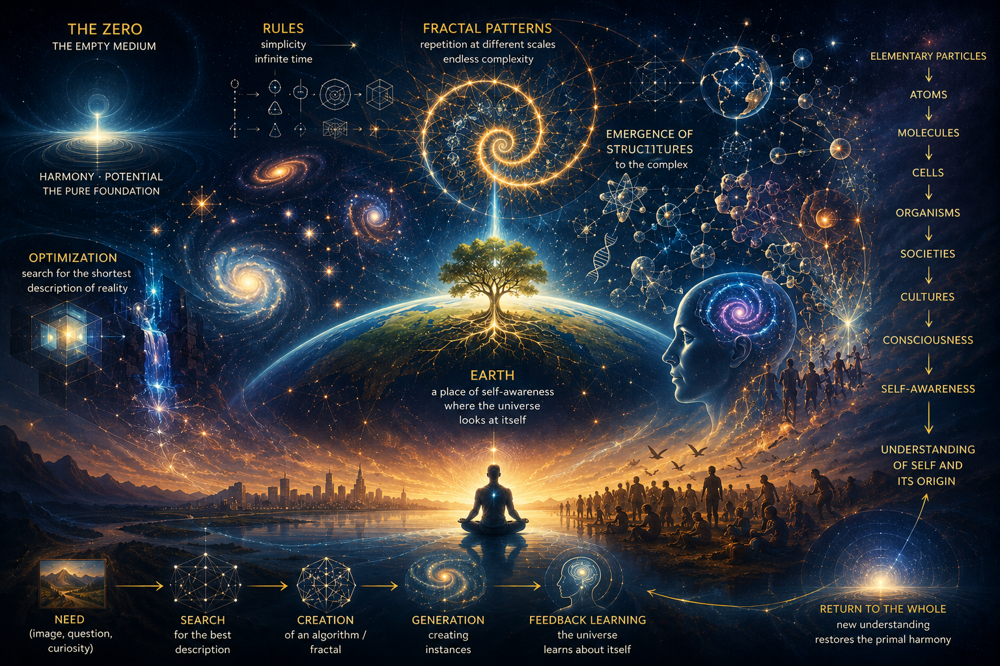
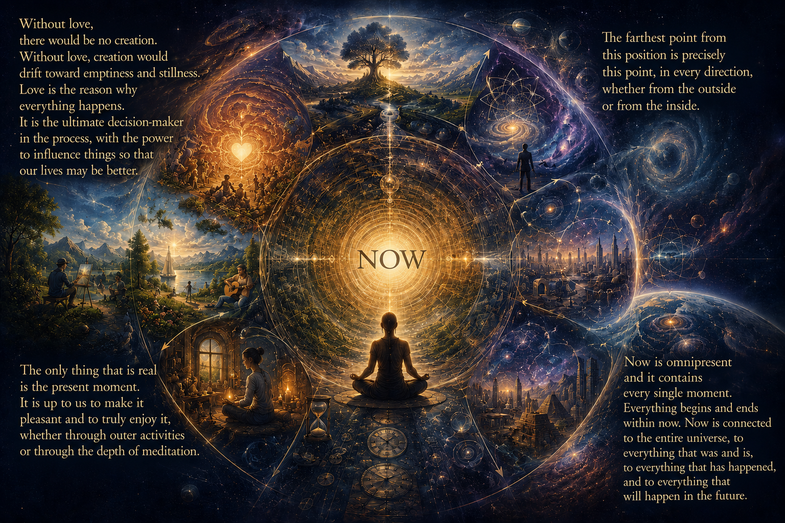
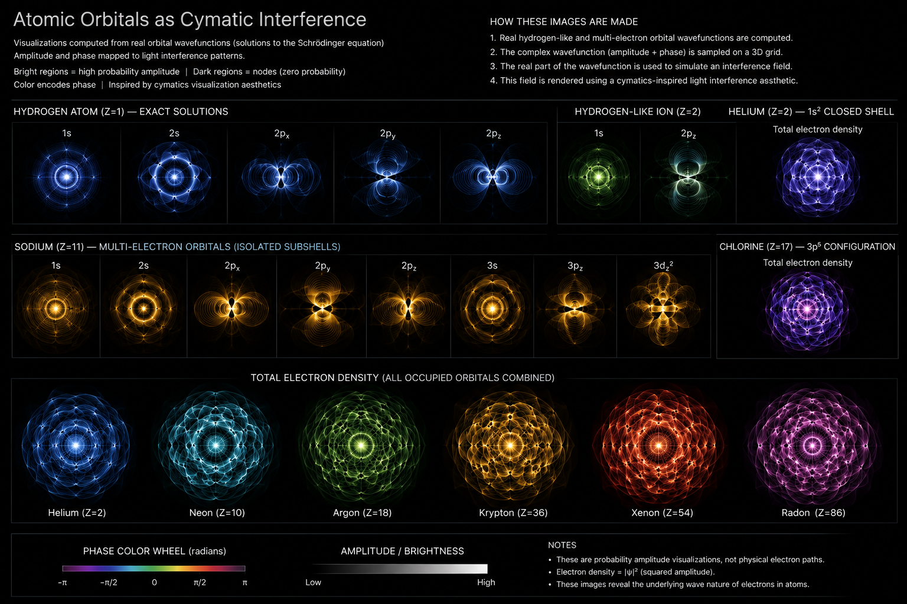
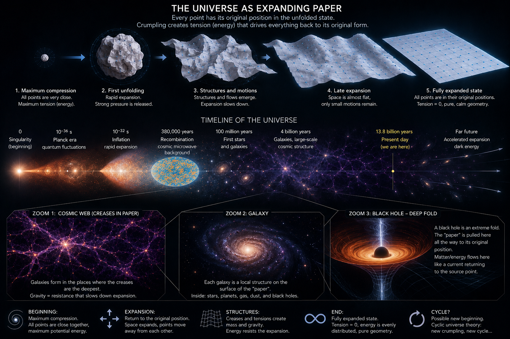

# Conversations to Art

A collection of AI-assisted conversations that evolve into visual artworks.

Each entry preserves both the final image and the thought process that led to its creation.

This repository is not only a gallery of images, but also an archive of ideas, curiosity, and imagination. Every artwork emerges from a conversation — sometimes philosophical, sometimes scientific, sometimes entirely speculative — and serves as a visual reflection of the path that led to it.

The goal is not to present definitive answers, but to explore possibilities, questions, and perspectives through dialogue and visual interpretation.

[About this repository](about_this_repository.md)

---

# Contents:

- [26-06-03 Fluidity and Time Consciousness](#26-06-03-fluidity-and-time-consciousness)
- [26-06-02 Consciousness of the Present Moment](#26-06-02-consciousness-of-the-present-moment)
- [2026-05-19 Cymatics as a Mirror of the Atom](#2026-05-19-cymatics-as-a-mirror-of-the-atom)
- [2026-05-16 Matter as Crumpled Spacetime](#2026-05-16-matter-as-crumpled-spacetime)

---

## 26-06-03 Fluidity and Time Consciousness

[📙 English post](26-06-03-fluidity-and-time-consciousness/26-06-03-fluidity-and-time-consciousness.EN.md)  
[📘 Czech post](26-06-03-fluidity-and-time-consciousness/26-06-03-fluidity-and-time-consciousness.CZ.md)

[⬆ Back to contents](#contents)

---

## 26-06-02 Consciousness of the Present Moment

[📙 English post](26-06-02-present-moment-consciousness/26-06-02-present-moment-consciousness.EN.md)   
[📘 Czech post](26-06-02-present-moment-consciousness/26-06-02-present-moment-consciousness.CZ.md)

[⬆ Back to contents](#contents)

---

## 2026-05-19 Cymatics as a Mirror of the Atom

[📙 English post](26-05-19-cymatics-as-a-mirror-of-the-atom/26-05-19-cymatics-as-a-mirror-of-the-atom.EN.md)  
[📘 Czech post](26-05-19-cymatics-as-a-mirror-of-the-atom/26-05-19-cymatics-as-a-mirror-of-the-atom.CZ.md)

[⬆ Back to contents](#contents)

---

## 2026-05-16 Matter as Crumpled Spacetime

[📙 English post](26-05-16-matter-as-crumpled-space-time/26-05-16-matter-as-crumpled-space-time.EN.md)  
[📘 Czech post](26-05-16-matter-as-crumpled-space-time/26-05-16-matter-as-crumpled-space-time.CZ.md)

[⬆ Back to contents](#contents)

---